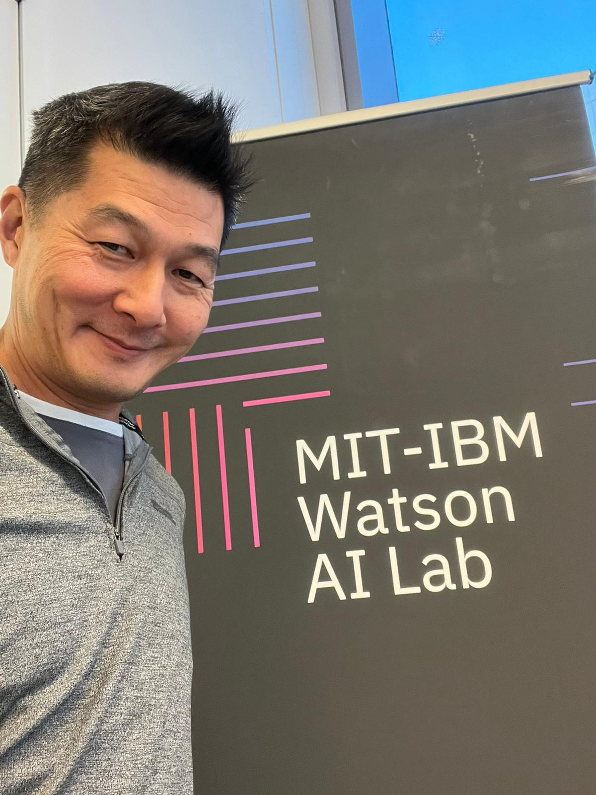
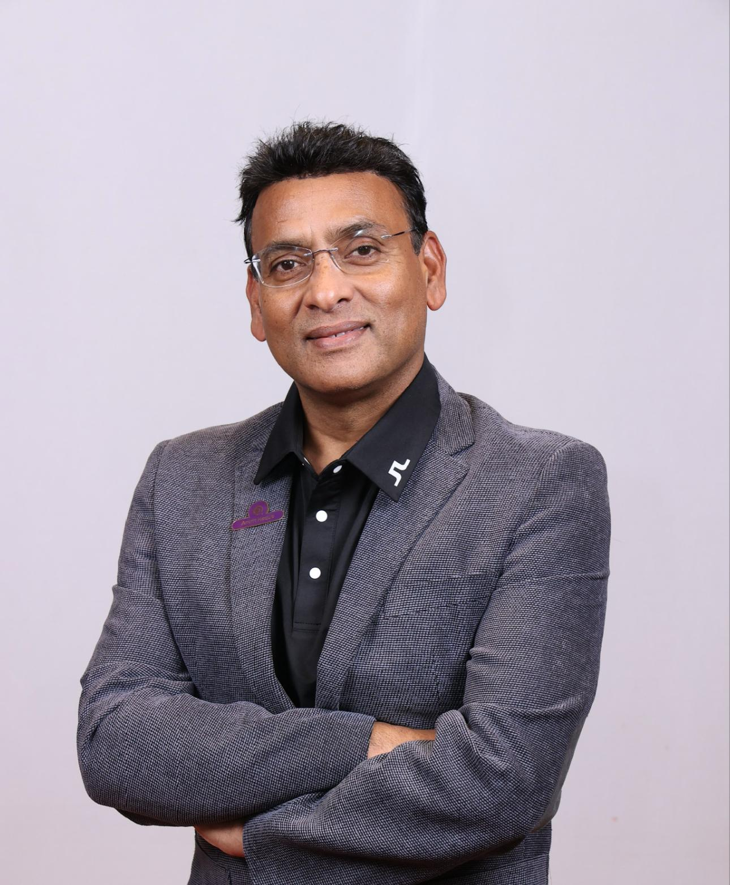

# TechAccel Framework

The TechAccel Framework (TAF) is a structured methodology designed to help organizations adopt new technologies efficiently and effectively. It is industry-agnostic and aims to address the common challenges of technology adoption, including prolonged innovation cycles, stakeholder misalignment, and scalability issues.

---

## Overview

TAF is built around four key stages:
1. **Technology Scouting and Assessment**: Identify and evaluate emerging technologies that align with organizational goals.
2. **Feasibility Analysis**: Assess the technical, operational, and financial viability of the selected technology.
3. **Pilot Implementation**: Validate the technology in a controlled environment and refine it based on feedback.
4. **Validation and Scaling**: Scale the implementation across the organization, ensuring alignment with long-term objectives.

This framework enables organizations to streamline technology adoption, mitigate risks, and foster innovation while maintaining agility and adaptability.

---

## Getting Started

To get started with the TechAccel Framework, read the full documentation here:
[TechAccel Framework Document](https://github.com/danielcbright/TechAccel/blob/initial_branch/techaccel_framework.md).

For details on contributing to the framework, refer to the [Contribution Guide](./CONTRIBUTING.md).

---

## Key Features
- **Scalable Methodology**: Applicable across industries and adaptable to various organizational needs.
- **Comprehensive Stages**: Guides users from initial technology identification to full-scale implementation.
- **Collaborative Approach**: Emphasizes stakeholder involvement and clear communication at every stage.

---

## License

The TechAccel Framework is licensed under the [MIT License](./LICENSE.md).

---

## Contributing

We welcome contributions to improve and expand the TechAccel Framework. Whether you want to suggest enhancements, provide feedback, or contribute supporting documents, check out our [Contribution Guide](./CONTRIBUTING.md).

---

## Founding Contributors

We want to recognize the individuals who played a pivotal role in developing the TechAccel Framework. Below is the list of founding contributors:

-  **Kimmo Niemi**
-  **Chris P**
-  **Shweta Khosla**
-  **Daniel Bright**
-  **Savithri**
-  **Anam**

---

## Acknowledgments

This framework was developed as part of the MIT Technology Leadership Program (TLP) Cohort of 2024/2025. Special thanks to all contributors for their insights and support in making this framework a valuable resource for organizations worldwide.
